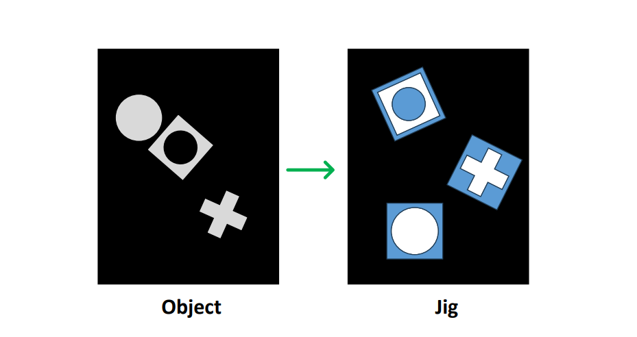
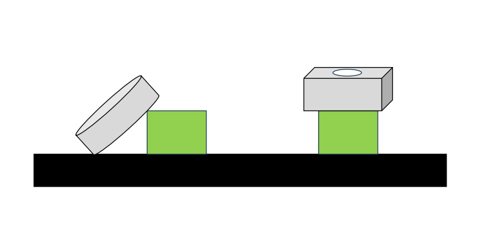

# Robot Manipulation - Bin Picking

Intel RealSense D455 RGB-D 카메라와 RB5 협동로봇을 사용하여 물체의 6D pose를 추정하고, 로봇이 grasp 및 peg-in-hole insertion을 수행하는 프로젝트입니다.

---

## Demo

<p align="center">
  <a href="https://youtu.be/lljcPwNJVUM?si=-M68miIis1vrQdBE">
    
  </a>
</p>

<p align="center">
  
  
</p>

---

## System Pipeline

```text
Hand-Eye Calibration
        ↓
YOLOv8 Segmentation
        ↓
FoundationPose 6D Pose Estimation
        ↓
Grasp Pose Generation
        ↓
Template Matching for Insert Target
        ↓
Force-Controlled Peg-in-Hole Insertion
```

---

## Method

### 1. Hand-Eye Calibration

카메라에서 추정한 물체 pose를 로봇이 사용할 수 있도록, hand-eye calibration을 통해 camera frame과 robot base frame 사이의 변환 행렬을 계산합니다.

초기 위치에서 calibration board의 위치를 추정하고, 샘플링된 여러 지점에서 로봇 TCP가 보드 방향을 바라보도록 이동한 뒤 이미지를 촬영하여 hand-eye calibration을 수행합니다.

---

### 2. 6D Pose Estimation

YOLOv8 segmentation으로 물체 mask를 추출한 뒤, RGB-D image, mask, CAD model을 FoundationPose에 입력하여 물체의 6D pose를 추정합니다.

---

### 3. Grasp Pose Generation

추정된 object pose를 그대로 사용하지 않고, parallel gripper가 접근 가능한 grasp pose로 변환합니다.

물체의 지면 대비 기울기와 그리퍼 접근 방향을 기준으로 안정적인 grasp 방향을 선택합니다.

---

### 4. Insert Detection & Force Control

Insert target은 template matching을 이용해 검출합니다.

로봇은 검출된 위치로 이동한 뒤, 최종 삽입 단계에서는 force control을 사용해 peg-in-hole 작업을 수행합니다.

---

## Environment

| Component | Version / Device               |
| --------- | ------------------------------ |
| OS        | Ubuntu 22.04                   |
| ROS       | ROS2 Humble                    |
| Camera    | Intel RealSense D455           |
| Robot     | RB5 Collaborative Robot        |
| GPU       | NVIDIA GeForce RTX 4060 Laptop |
| Detection | YOLOv8 Segmentation            |
| 6D Pose   | FoundationPose                 |
| Control   | Force Control                  |

---


